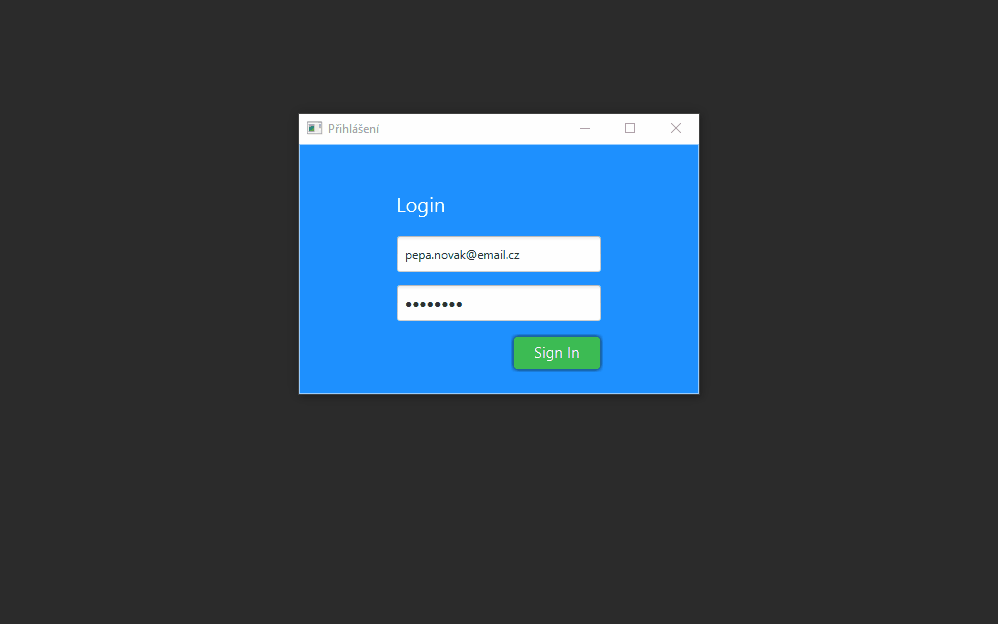

# JavaFX CRUD application - User Management

## Disclainer
* The original code is forked from https://github.com/RamAlapure/JavaFXSpringBootApp.git, which is an excelend demo appliactoin how to develop JavaFx application with Spring, JavaFx and Java 8. The author also recoded nice video to this demno application which you can find in [here in youtube](https://www.youtube.com/watch?v=NQQOPy-jmhA)
* I used this application as a template and migrated it to Spring Boot 2 with Java 11. All dependencies are provided by Maven, the application runs out of the box.
The application frontend created using JavaFX and backend services are implemented using Spring Boot. The app demonstrate simple CRUD operation and switching between two scenes with Login and User Dashboard view. 
* Migration to Java 11 and Spring Boot 2 was possible thanks to this tiny, yet powerful [JavaFX Weaver library](https://github.com/rgielen/javafx-weaver)
* Thanks to both aouthors of the original application and of the JavaFX Weaver library.



# Features
* CRUD application - creates, reads, updates, deletes users from/into relational database (postgres in this case. Must be installed separately)
* Supports language switching
* Runs with Java 11+, Spring Boot 2, JavaFX weaver. 
* Mavenized project. All dependencies are downloaded by maven

# How to run 
* instal postgressql DB
* configure your DB connection in [application.properties](src/main/resources/application.properties) file
* create new table (from any DB client)
    ```sql
    create table users
    (
        id bigserial not null
            constraint users_pkey
                primary key,
        dob bytea,
        email varchar(255),
        first_name varchar(255),
        gender varchar(255),
        last_name varchar(255),
        password varchar(255),
        role varchar(255)
    );
    ```

* alter table users owner to postgres;
    ```sql
    INSERT INTO public.users (id, dob, email, first_name, gender, last_name, password, role) VALUES (1, '2020-04-01', 'user1@email.cz', 'Franta', 'Male', 'KomArek', 'Password1', 'Admin');
    INSERT INTO public.users (id, dob, email, first_name, gender, last_name, password, role) VALUES (10, '2020-03-31', 'user2@email.cz', 'Sarka', 'Female', 'Zubata', 'Password2', 'User');
    ```

* configure connection properties in 
* run with ```clean install spring-boot:run``` or just ring MainApp.java from your IDE
