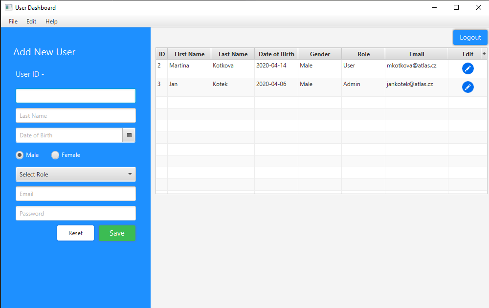

# JavaFX Spring Boot App (runs with JDK 1.8 only)
The application frontend created using JavaFX and backend services are implemented using Spring Boot. The app demonstrate simple CRUD operation and switching between two scenes with Login and User Dashboard view. 

Tutorial taken from [this youtube channel](https://www.youtube.com/watch?v=NQQOPy-jmhA)



user/password [jankotek@atlas.cz / test]

# Getting Started:

1. Clone the project in your workspace using command - git clone https://github.com/RamAlapure/JavaFXSpringBootApp.git
2. Then import as maven project into eclipse.
3. Check Java 8 configuration if there is any error.
4. Update project as maven if dependencies are not resolved.
5. Create a schema javafx in your mysql database or open configuration file application.properties from resources directory and change schema name to your schema name and also change username and password.
6. If all goes well just run Main.java

# How to run 
* start postgressql DB
* create new table
```sql
create table users
(
	id bigserial not null
		constraint users_pkey
			primary key,
	dob bytea,
	email varchar(255),
	first_name varchar(255),
	gender varchar(255),
	last_name varchar(255),
	password varchar(255),
	role varchar(255)
);

alter table users owner to postgres;
```
* populate the table 
```sql
INSERT INTO public.users (id, dob, email, first_name, gender, last_name, password, role) VALUES (2, E'\\xACED00057372000D6A6176612E74696D652E536572955D84BA1B2248B20C00007870770703000007E4040E78', 'mkotkova@atlas.cz', 'Martina', 'Male', 'Kotkova', 'test', 'User');
INSERT INTO public.users (id, dob, email, first_name, gender, last_name, password, role) VALUES (3, E'\\xACED00057372000D6A6176612E74696D652E536572955D84BA1B2248B20C00007870770703000007E4040678', 'jankotek@atlas.cz', 'Jan', 'Male', 'Kotek', 'test', 'Admin');
INSERT INTO public.users (id, dob, email, first_name, gender, last_name, password, role) VALUES (4, E'\\xACED00057372000D6A6176612E74696D652E536572955D84BA1B2248B20C00007870770703000007E4040378', 'hexenwerk.betty@gmail.com', 'Betty', 'Female', 'Kotkova', 'test', 'User');
```
* configure connection properties in 

# build and run with Java 11
* you must use maven plugin to fetch all necessary JavaFx dependencies 
    ```
              <plugin>
                  <groupId>org.openjfx</groupId>
                  <artifactId>javafx-maven-plugin</artifactId>
                  <version>0.0.4</version>
                  <configuration>
                      <mainClass>com.codetreatise.Main</mainClass>
                  </configuration>
              </plugin>
    ```
* run ```mvn clean package``` to build fat JAR with all javafx dependencies
* run ```java -jar JavaFXSpringBootApp-1.0.jar```